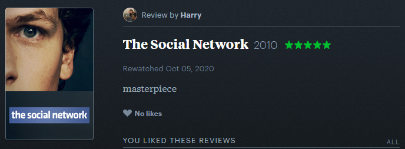
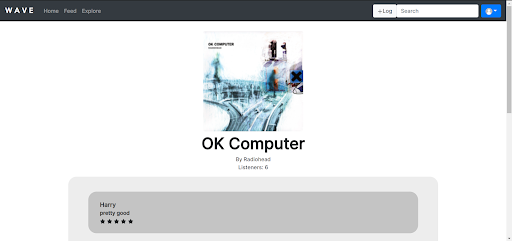
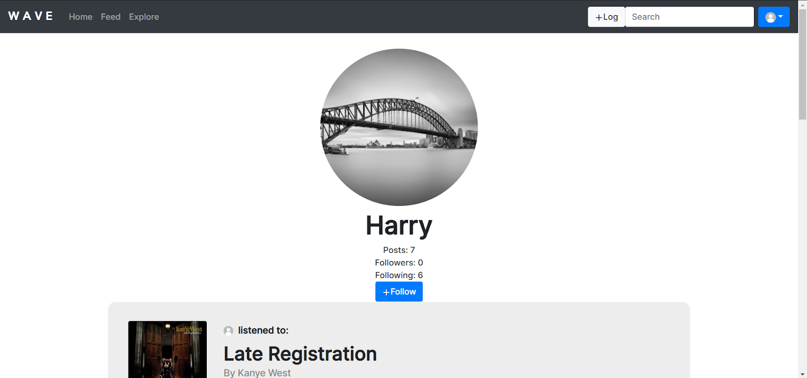
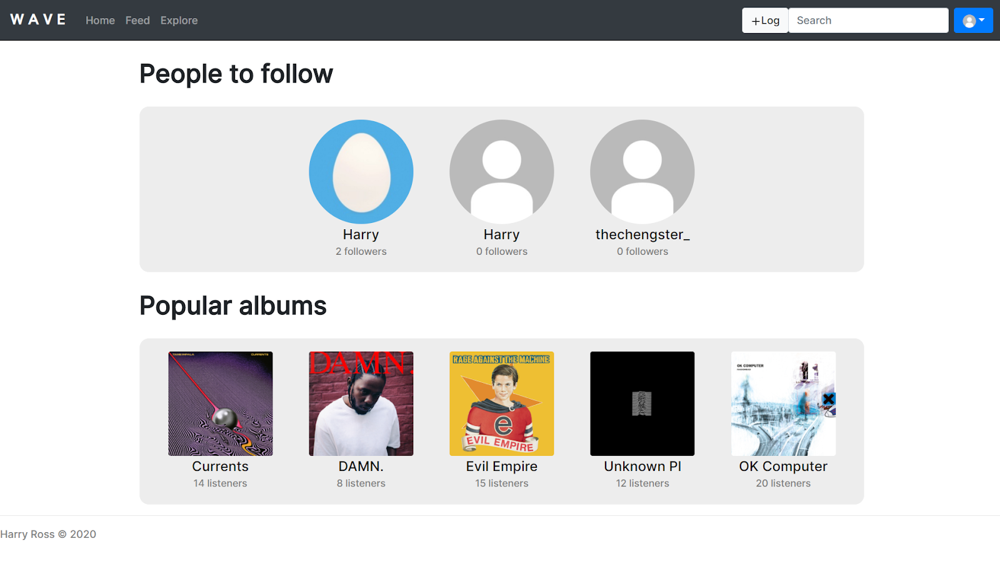
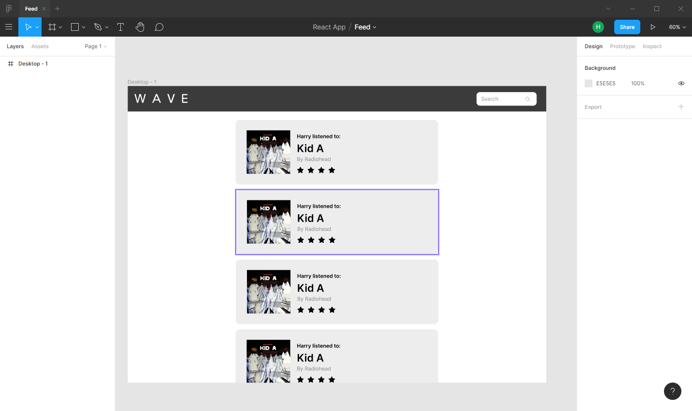

# Intro
At the beginning of this year, I realised that I needed to turn one of my many and numerous idea/s that I accumulated over my many long years on this Earth into a major project for my Year 11 Software Design and Development class. Originally I was looking at creating a easy-to-use server hosting platform with a load of templates, but decided that it wouldn't be as interesting and oversaturated as my much better idea. The basic idea of what I wanted to create was a social platform similar to [Letterboxd](https://letterboxd.com/), but instead of sharing and reviewing films users can share and review the music they listen to. 

The reason why I would like to create a platform like Letterboxd is that I love how that platform has allowed me to discover films and provide (almost) an incentive to share the films I watched with my friends, and I think it would work great as a music sharing platform and add a new social dimension to listening to music. 

# Functionality
So far, the vast majority of the features that I wanted in the web app were developed in the short time that I had, which included:
* Authentication (signin/register) using [JWT](http://jwt.io/)
* Album/artist pages using the [Last.FM API](https://www.last.fm/api) 
* User logging of albums
* User profiles 
* Following/follower system
* Feed that displays all posts of followed users
* Mostly functional explore page (displays users with mock album data) 

Currently the only features that still need to be developed are the search function and a further refinement of the album logging UI.

# Technology
## Frontend
At the beginning of the project, I wanted to use a templating language such as [EJS](https://ejs.co/) or [Pug](https://pugjs.org/) to allow for a fast development time, but I realised that if I wanted the web app to allow for modularity and use the project as an oppurtunity to develop useful industry skills I would have to use a commonly used Javascript framework, which is why I chose [React](https://reactjs.org/). 

## Backend
I have used a few different backend frameworks (Go, ASP.NET, Django, PHP), but sadly have spent a large amount of time using [Node.JS](https://nodejs.org) and other Javascript frameworks, so that's what was used when developing the project. I considered using [ASP.NET](https://dotnet.microsoft.com/apps/aspnet) for a few minutes, but decided against due to my exponentially greater level of experience using Node. 

## Database
In a few of the projects I developed in the past, I used MongoDB due to how well it works with Node, but due to the nature of the fact that the project is a social platform, a relational database needed to be used. I decided to use MySQL due to its popularity and that I used it a few years ago in a PHP

# Design
To allow for a mild visual consistency across the project, I used the [React-Bootstrap](https://react-bootstrap.github.io/) package as I had used Bootstrap in the past and love how easy it is to use. 

I used [Figma](https://www.figma.com/) to design mockups of the different pages across the application, which is a genuinely great tool that I will definitely be using again!

I really would have liked to spend a lot more time on the overall design of the web app, but due to the limited timeframe that this project had to be completed in, I settled on a mostly monochromatic minimalist design that could easily allow for a variety of album and artist images to be incorporated and displayed.

# Musings
I am genuinely proud of what I was able to accomplish in only a few months, and I hope that I will be able to continue working on the project far into the future!

# Let's see this thing!
Alright, alright - you can find the site at https://wave.classicdavis.xyz, have fun!